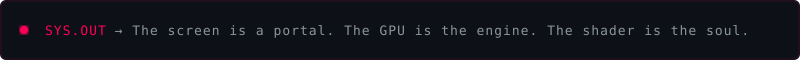

<!-- ═══════════════════════════════════════════════════════ -->
<!-- CUSTOM ANIMATED HEADER — GLITCH + SCANLINES + PARTICLES -->
<!-- ═══════════════════════════════════════════════════════ -->

 

<!-- ═══════════════════════════════════════════════════════ -->
<!-- CUSTOM ANIMATED TERMINAL BIO                          -->
<!-- ═══════════════════════════════════════════════════════ -->

 

 

<!-- ═══════════════════════════════════════════════════════ -->
<!-- ANIMATED SKILL BARS — "THREAT LEVEL ASSESSMENT"       -->
<!-- ═══════════════════════════════════════════════════════ -->

 

 

<!-- ═══════════════════════════════════════════════════════ -->
<!-- STATS HUD                                              -->
<!-- ═══════════════════════════════════════════════════════ -->

### `// SYSTEM DIAGNOSTICS`

 

 

 

 

<!-- ═══════════════════════════════════════════════════════ -->
<!-- TROPHIES                                               -->
<!-- ═══════════════════════════════════════════════════════ -->

### `// ACHIEVEMENTS`

 

 

 

<!-- ═══════════════════════════════════════════════════════ -->
<!-- CONTRIBUTION SNAKE                                     -->
<!-- ═══════════════════════════════════════════════════════ -->

### `// WATCH MY CONTRIBUTIONS GET EATEN`

 

<picture>
  <source media="(prefers-color-scheme: dark)" srcset="https://github.com/nff747/nff747/blob/output/github-snake-dark.svg" />
  <source media="(prefers-color-scheme: light)" srcset="https://github.com/nff747/nff747/blob/output/github-snake.svg" />
  
</picture>

 

 

<!-- ═══════════════════════════════════════════════════════ -->
<!-- FOOTER                                                 -->
<!-- ═══════════════════════════════════════════════════════ -->

  

  

