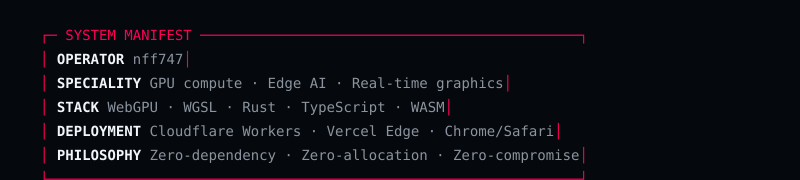
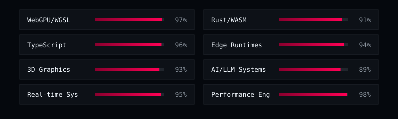
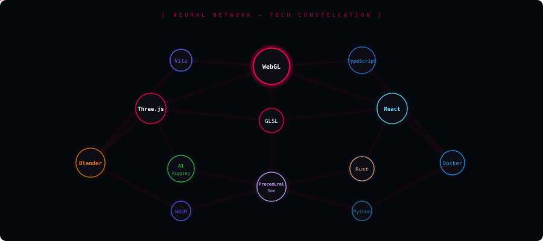

<!-- ▓▓▓▓▓▓▓▓▓▓▓▓▓▓▓▓▓▓▓▓▓▓▓▓▓▓▓▓▓▓▓▓▓▓▓▓▓▓▓▓▓▓▓▓▓▓▓▓▓▓▓▓▓▓▓▓▓▓▓ -->
<!-- HUD HEADER // CYBERPUNK GLITCH HERO                          -->
<!-- ▓▓▓▓▓▓▓▓▓▓▓▓▓▓▓▓▓▓▓▓▓▓▓▓▓▓▓▓▓▓▓▓▓▓▓▓▓▓▓▓▓▓▓▓▓▓▓▓▓▓▓▓▓▓▓▓▓▓▓ -->

<!-- ▓▓▓▓▓▓▓▓▓▓▓▓▓▓▓▓▓▓▓▓▓▓▓▓▓▓▓▓▓▓▓▓▓▓▓▓▓▓▓▓▓▓▓▓▓▓▓▓▓▓▓▓▓▓▓▓▓▓▓ -->
<!-- INTERACTIVE HUD NAVIGATION DOCK (CLICKABLE QUICK-JUMPS)       -->
<!-- ▓▓▓▓▓▓▓▓▓▓▓▓▓▓▓▓▓▓▓▓▓▓▓▓▓▓▓▓▓▓▓▓▓▓▓▓▓▓▓▓▓▓▓▓▓▓▓▓▓▓▓▓▓▓▓▓▓▓▓ -->

  <a href="#-01-core-identity"><code><b>[ ⬡ 01. IDENTITY ]</b></code></a> &nbsp;
  <a href="#-02-flagship-engines"><code><b>[ ⚡ 02. ENGINES ]</b></code></a> &nbsp;
  <a href="#-03-diagnostics--radar"><code><b>[ 📡 03. DIAGNOSTICS ]</b></code></a> &nbsp;
  <a href="#-04-live-telemetry"><code><b>[ 📊 04. TELEMETRY ]</b></code></a> &nbsp;
  <a href="#-05-ecosystem-map"><code><b>[ 🌐 05. HEATMAP ]</b></code></a>

  
  
  

 

<!-- ▓▓▓▓▓▓▓▓▓▓▓▓▓▓▓▓▓▓▓▓▓▓▓▓▓▓▓▓▓▓▓▓▓▓▓▓▓▓▓▓▓▓▓▓▓▓▓▓▓▓▓▓▓▓▓▓▓▓▓ -->
<!-- MODULE 01 // CORE IDENTITY & SYSTEM SPECS                     -->
<!-- ▓▓▓▓▓▓▓▓▓▓▓▓▓▓▓▓▓▓▓▓▓▓▓▓▓▓▓▓▓▓▓▓▓▓▓▓▓▓▓▓▓▓▓▓▓▓▓▓▓▓▓▓▓▓▓▓▓▓▓ -->

  

<b><code>[ ⬡ TOGGLE SYSTEM MANIFEST // TERMINAL SPECIFICATIONS ]</code></b> <i>(Click to expand/collapse)</i>

 

  

  

<!-- ▓▓▓▓▓▓▓▓▓▓▓▓▓▓▓▓▓▓▓▓▓▓▓▓▓▓▓▓▓▓▓▓▓▓▓▓▓▓▓▓▓▓▓▓▓▓▓▓▓▓▓▓▓▓▓▓▓▓▓ -->
<!-- MODULE 02 // 6 FLAGSHIP WEBGPU & AI ENGINES                  -->
<!-- ▓▓▓▓▓▓▓▓▓▓▓▓▓▓▓▓▓▓▓▓▓▓▓▓▓▓▓▓▓▓▓▓▓▓▓▓▓▓▓▓▓▓▓▓▓▓▓▓▓▓▓▓▓▓▓▓▓▓▓ -->

  

<b><code>[ ⚡ TOGGLE DEPLOYED ENGINES // 6 ACTIVE REPOSITORIES ]</code></b> <i>(Click to expand/collapse)</i>

 

<table>
<tr>
<td align="center" width="50%">
  
  

    <a href="https://github.com/nff747/splat-bvh-core"><code><b>[ ⚡ REPOSITORY ]</b></code></a> &nbsp;
    <a href="https://github.com/nff747/splat-bvh-core#how-it-works-the-karras-lbvh-pipeline"><code><b>[ 📖 WGSL ARCHITECTURE ]</b></code></a>
  

</td>
<td align="center" width="50%">
  
  

    <a href="https://github.com/nff747/webgpu-vram-pager"><code><b>[ ⚡ REPOSITORY ]</b></code></a> &nbsp;
    <a href="https://github.com/nff747/webgpu-vram-pager#the-solution-pcie-ring-buffered-paging"><code><b>[ 📖 RING BUFFERS ]</b></code></a>
  

</td>
</tr>
<tr>
<td align="center" width="50%">
  
  

    <a href="https://github.com/nff747/neural-texture-engine"><code><b>[ ⚡ REPOSITORY ]</b></code></a> &nbsp;
    <a href="https://github.com/nff747/neural-texture-engine#solving-the-3d-web-payload-bottleneck"><code><b>[ 📖 AI GENERATION ]</b></code></a>
  

</td>
<td align="center" width="50%">
  
  

    <a href="https://github.com/nff747/auto-rig-web"><code><b>[ ⚡ REPOSITORY ]</b></code></a> &nbsp;
    <a href="https://github.com/nff747/auto-rig-web#architecture"><code><b>[ 📖 WORKER PIPELINE ]</b></code></a>
  

</td>
</tr>
<tr>
<td align="center" width="50%">
  
  

    <a href="https://github.com/nff747/spatial-glass-ui"><code><b>[ ⚡ REPOSITORY ]</b></code></a> &nbsp;
    <a href="https://github.com/nff747/spatial-glass-ui#custom-glsl-shader-architecture"><code><b>[ 📖 GLSL SHADERS ]</b></code></a>
  

</td>
<td align="center" width="50%">
  
  

    <a href="https://github.com/nff747/edge-context-router"><code><b>[ ⚡ REPOSITORY ]</b></code></a> &nbsp;
    <a href="https://github.com/nff747/edge-context-router#architecture-hybrid-orchestration"><code><b>[ 📖 GRAPH MVC ]</b></code></a>
  

</td>
</tr>
</table>

  

<!-- ▓▓▓▓▓▓▓▓▓▓▓▓▓▓▓▓▓▓▓▓▓▓▓▓▓▓▓▓▓▓▓▓▓▓▓▓▓▓▓▓▓▓▓▓▓▓▓▓▓▓▓▓▓▓▓▓▓▓▓ -->
<!-- MODULE 03 // DIAGNOSTICS, RADAR & WAVEFORM HUD               -->
<!-- ▓▓▓▓▓▓▓▓▓▓▓▓▓▓▓▓▓▓▓▓▓▓▓▓▓▓▓▓▓▓▓▓▓▓▓▓▓▓▓▓▓▓▓▓▓▓▓▓▓▓▓▓▓▓▓▓▓▓▓ -->

  

<b><code>[ 📡 TOGGLE HARDWARE TELEMETRY // RADAR & WAVEFORM SUITE ]</b></code> <i>(Click to expand/collapse)</i>

 

<table>
<tr>
<td align="center" width="50%">
  
</td>
<td align="center" width="50%">
  
    
  
</td>
</tr>
</table>

 

  

<!-- ▓▓▓▓▓▓▓▓▓▓▓▓▓▓▓▓▓▓▓▓▓▓▓▓▓▓▓▓▓▓▓▓▓▓▓▓▓▓▓▓▓▓▓▓▓▓▓▓▓▓▓▓▓▓▓▓▓▓▓ -->
<!-- MODULE 04 // LIVE TELEMETRY (REAL-TIME METRICS)              -->
<!-- ▓▓▓▓▓▓▓▓▓▓▓▓▓▓▓▓▓▓▓▓▓▓▓▓▓▓▓▓▓▓▓▓▓▓▓▓▓▓▓▓▓▓▓▓▓▓▓▓▓▓▓▓▓▓▓▓▓▓▓ -->

  

<b><code>[ 📊 TOGGLE REAL-TIME BENCHMARKS // LIVE GITHUB STATS ]</b></code> <i>(Click to expand/collapse)</i>

 

<table>
<tr>
<td align="center" width="50%">
  
</td>
<td align="center" width="50%">
  
</td>
</tr>
<tr>
<td colspan="2" align="center">
  
</td>
</tr>
</table>

  

<!-- ▓▓▓▓▓▓▓▓▓▓▓▓▓▓▓▓▓▓▓▓▓▓▓▓▓▓▓▓▓▓▓▓▓▓▓▓▓▓▓▓▓▓▓▓▓▓▓▓▓▓▓▓▓▓▓▓▓▓▓ -->
<!-- MODULE 05 // REAL-TIME CONTRIBUTION HEATMAP                  -->
<!-- ▓▓▓▓▓▓▓▓▓▓▓▓▓▓▓▓▓▓▓▓▓▓▓▓▓▓▓▓▓▓▓▓▓▓▓▓▓▓▓▓▓▓▓▓▓▓▓▓▓▓▓▓▓▓▓▓▓▓▓ -->

  

<b><code>[ 🌐 TOGGLE 365-DAY HEATMAP // REAL-TIME ACTIVITY STREAM ]</b></code> <i>(Click to expand/collapse)</i>

 

  

  

<!-- ▓▓▓▓▓▓▓▓▓▓▓▓▓▓▓▓▓▓▓▓▓▓▓▓▓▓▓▓▓▓▓▓▓▓▓▓▓▓▓▓▓▓▓▓▓▓▓▓▓▓▓▓▓▓▓▓▓▓▓ -->
<!-- FOOTER // EPILOGUE & VISITOR TELEMETRY                       -->
<!-- ▓▓▓▓▓▓▓▓▓▓▓▓▓▓▓▓▓▓▓▓▓▓▓▓▓▓▓▓▓▓▓▓▓▓▓▓▓▓▓▓▓▓▓▓▓▓▓▓▓▓▓▓▓▓▓▓▓▓▓ -->

  

  

