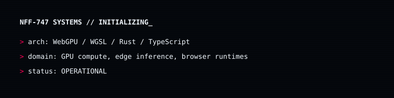

Systems & Graphics Engineer specializing in **WebGPU compute**, **browser-native LLM runtimes**, and **high-performance memory architectures**. I build infrastructure that forces the browser to run code it wasn't designed for.

### ⚡ Selected Open-Source Work

#### 🎮 WebGPU & Compute Shaders
* **[cr-vector-sync](https://github.com/nff747/cr-vector-sync)** — WebAssembly/WebGPU local-first Vector Database with E2E encrypted peer-to-peer CRDT syncing via OPFS.
* **[paged-attention-wgsl](https://github.com/nff747/paged-attention-wgsl)** — High-throughput PagedAttention & block-tiled KV-cache virtual memory engine for running multi-head transformer models on WebGPU.
* **[flash-attention-wgsl](https://github.com/nff747/flash-attention-wgsl)** — Hardware-tiled Online Softmax FlashAttention-2 compute engine in WebGPU & WGSL. Eliminates O(N²) intermediate attention matrix allocations with workgroup SRAM cache tiling and causal masking.
* **[webgpu-vram-pager](https://github.com/nff747/webgpu-vram-pager)** — Virtual memory paging & ring buffer for executing 8B+ LLMs in-browser, bypassing WebGPU `maxStorageBufferBindingSize` limits.
* **[radiance-cascades-wgsl](https://github.com/nff747/radiance-cascades-wgsl)** — Real-time flat & nested radiance cascades for global illumination and volumetric light transport.
* **[subsurface-scattering-wgsl](https://github.com/nff747/subsurface-scattering-wgsl)** — Multi-layered separable BSSRDF approximations with Gaussian convolutions for human skin rendering in WebGPU.
* **[ocean-fft-wgsl](https://github.com/nff747/ocean-fft-wgsl)** — Radix-2 Fast Fourier Transform for real-time ocean wave simulation (Phillips spectrum) in WGSL compute shaders.
* **[volumetric-clouds-wgsl](https://github.com/nff747/volumetric-clouds-wgsl)** — Multi-scattering raymarching through Worley/Perlin noise density volumes with Beer's Law attenuation.
* **[marching-cubes-wgsl](https://github.com/nff747/marching-cubes-wgsl)** — GPU-accelerated isosurface extraction and procedural terrain generation with prefix-sum compaction.

#### ⚙️ Data Structures & Low-Level Infrastructure
* **[splat-bvh-core](https://github.com/nff747/splat-bvh-core)** — Parallel Bounding Volume Hierarchy constructor and frustum culling engine for 3D Gaussian Splatting rendering.
* **[swarm-refactor](https://github.com/nff747/swarm-refactor)** — Distributed multi-agent execution framework built on Node worker threads with shared ArrayBuffer state locks.
* **[hyper-hnsw-core](https://github.com/nff747/hyper-hnsw-core)** — Browser-native Hierarchical Navigable Small World vector search implementation.
* **[helix-lsm](https://github.com/nff747/helix-lsm)** — Log-Structured Merge tree optimized for WASM runtimes (edge KV emulation).
* **[nova-wasm](https://github.com/nff747/nova-wasm)** — Portable sandboxed execution environment built for zero-trust multi-tenant serverless nodes.

#### 🧰 Middleware & Network Architecture
* **[agentic-memory-kv](https://github.com/nff747/agentic-memory-kv)** — High-speed strictly typed Key-Value store mapped over SharedArrayBuffer for multi-agent LLM systems.
* **[edge-context-router](https://github.com/nff747/edge-context-router)** — Ultra-low latency V8 isolate request router for multi-tenant edge AI API gateways.
* **[idempotency-middleware](https://github.com/nff747/idempotency-middleware)** — Distributed Redis-backed idempotency lock system to prevent race conditions on multi-node inference endpoints.

